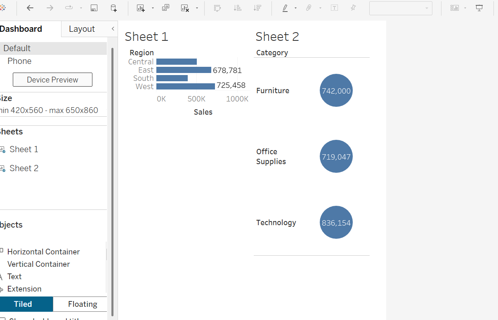

# 📊 Task 2 – Tableau Dashboard (Superstore Sales Insights)

## 🔍 Objective:
Analyze the Superstore dataset using Tableau and build an interactive dashboard that highlights key sales insights, trends, and performance metrics.

---

## 📁 Dataset:
**Name:** Sample Superstore Dataset  
**Source:** Provided in the Task PDF  
**Format:** Excel (.xls)

---

## 📊 Dashboard Overview:

The dashboard includes the following features:
- 📈 Sales Trend over Time
- 🗺️ Sales by Region and State (Map View)
- 💼 Category-wise and Sub-category-wise Sales & Profit
- 🚚 Top 10 Customers by Sales
- ⚠️ Profit vs Discount Analysis

---

## 📎 Tableau Public Link:
👉 [Click here to view the Dashboard](https://public.tableau.com/app/profile/preetham.reddy7228/viz/SuperstoreDashboard-SalesInsights/Dashboard1)

---

## 🖼️ Dashboard Preview:

---

## ✅ Tools Used:
- Tableau Public

---

## 💡 Key Insights:
- West Region has the highest sales, but South struggles in profitability.
- Office Supplies generate more sales but less profit compared to Technology.
- High discounts often lead to loss-making orders.
- Top 10 customers contribute significantly to overall revenue.

---

## 📌 Submitted By:
**Preetham Reddy**  
Intern at Elevate Labs  
